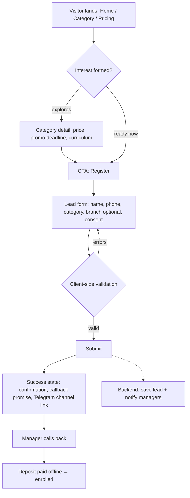
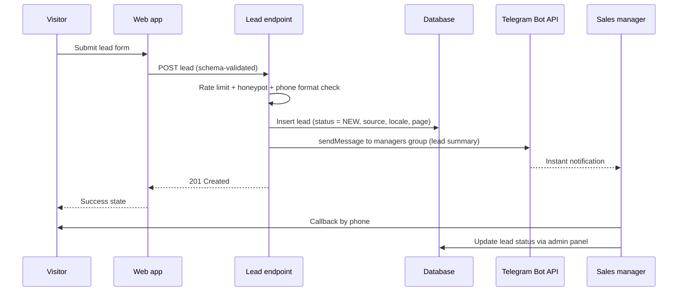
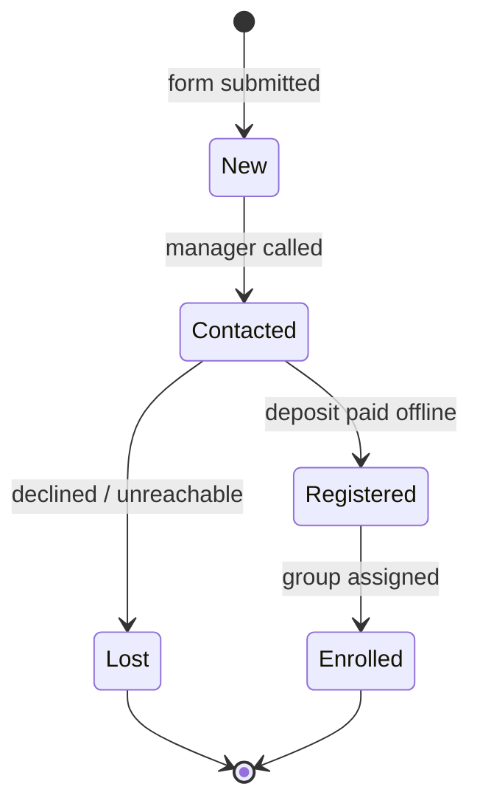
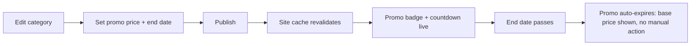
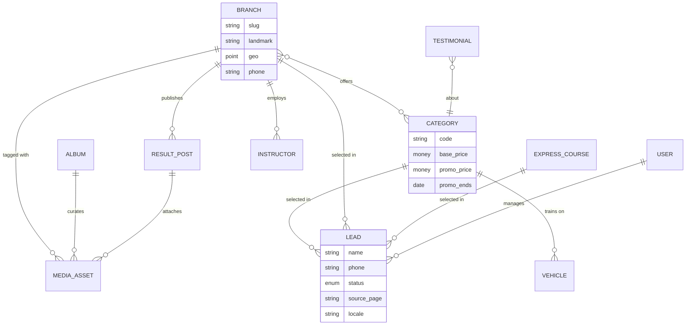

# 04 — Information Architecture

| Field | Value |
|---|---|
| Project | Turon Avtomaktab — Premium Mobile-First Web Platform |
| Document ID | 04 |
| Version | 1.0 (Draft — for client review) |
| Date | 2026-07-22 |
| Status | Awaiting approval |
| Depends on | 00 Project Overview, 01 Business Analysis (to be generated in Phase 5) |
| Feeds into | 05 Design System, 06 Page Specifications, 10 Multilingual System, 11 Admin Panel, 12 Database Design, 18 SEO |

---

## 1. Purpose & Scope

This document defines the complete Information Architecture (IA) for v1 of the Turon Avtomaktab platform: every page, URL, navigation structure, user flow, admin flow, content hierarchy, and the relationships between content entities. It is the structural contract for the platform. Visual and behavioral detail is deferred to documents 05–08; data-level detail is deferred to document 12.

**V1 scope (approved):** public marketing platform (Uzbek + Russian) + full admin CMS + lead capture with callback workflow. No online payment. No student accounts. Namespaces are reserved for v2 modules (§12).

## 2. IA Principles

1. **Two-tap rule.** From any page, a visitor reaches a lead action (form or call) in ≤ 2 taps. The registration CTA and click-to-call are globally persistent on mobile.
2. **Mobile-first hierarchy.** Section order and navigation are designed for a 360–430 px viewport first; desktop expands the same order, never reorders meaning.
3. **Bilingual parity.** Every public page exists in UZ and RU with equivalent content. No language is a second-class citizen; UZ is the default locale.
4. **Proof before persuasion.** Trust content (results, certificates, real media, license) is structurally adjacent to every conversion point.
5. **CMS-driven volatility.** Anything that changes monthly (prices, promos, results, media) is a content entity, never hardcoded.
6. **Scalable namespaces.** URL space is planned so v2 modules (test practice, student cabinet) attach without restructuring.

## 3. Public Site Map

### 3.1 Hierarchy Diagram

```mermaid
graph TD
  HOME["Home /"]

  HOME --> CAT["Categories hub /toifalar"]
  HOME --> EXP["Express courses /express-kurslar"]
  HOME --> PRICE["Pricing /narxlar"]
  HOME --> BR["Branches hub /filiallar"]
  HOME --> RES["Results /natijalar"]
  HOME --> GAL["Gallery /galereya"]
  HOME --> ABOUT["About /biz-haqimizda"]
  HOME --> FAQ["FAQ /savol-javob"]
  HOME --> CONTACT["Contact /aloqa"]
  HOME --> REG["Register /royxatdan-otish"]
  HOME --> LEGAL["Privacy /maxfiylik-siyosati"]

  subgraph Category detail pages
    CAT --> CB["/toifalar/b"]
    CAT --> CBC["/toifalar/bc"]
    CAT --> CC["/toifalar/c"]
    CAT --> CCE["/toifalar/ce"]
    CAT --> CBE["/toifalar/be"]
    CAT --> CA["/toifalar/a"]
    CAT --> CD["/toifalar/d"]
  end

  subgraph Branch detail pages
    BR --> B1["/filiallar/kosonsoy"]
    BR --> B2["/filiallar/tergachi"]
    BR --> B3["/filiallar/buloq-avtodrom"]
    BR --> B4["/filiallar/kamuna"]
    BR --> B5["/filiallar/bogishamol"]
    BR --> B6["/filiallar/namangan-shahar"]
    BR --> B7["/filiallar/toraqorgon"]
  end
```



### 3.2 Page Inventory

Priorities: **P0** = launch-blocking · **P1** = launch week · **P2** = fast-follow.

| ID | Page | Template | UZ path (default) | RU path | Priority | Primary goal |
|---|---|---|---|---|---|---|
| P-01 | Home | T-01 | `/` | `/ru` | P0 | Orient + convert |
| P-02 | Categories hub | T-02 | `/toifalar` | `/ru/kategorii` | P0 | Route to category |
| P-03 | Category B | T-03 | `/toifalar/b` | `/ru/kategorii/b` | P0 | Lead (preselected B) |
| P-04 | Category BC | T-03 | `/toifalar/bc` | `/ru/kategorii/bc` | P0 | Lead |
| P-05 | Category C | T-03 | `/toifalar/c` | `/ru/kategorii/c` | P0 | Lead |
| P-06 | Category CE | T-03 | `/toifalar/ce` | `/ru/kategorii/ce` | P0 | Lead |
| P-07 | Category BE | T-03 | `/toifalar/be` | `/ru/kategorii/be` | P0 | Lead |
| P-08 | Category A | T-03 | `/toifalar/a` | `/ru/kategorii/a` | P0 | Lead |
| P-09 | Category D | T-03 | `/toifalar/d` | `/ru/kategorii/d` | P0 | Lead |
| P-10 | Express courses | T-04 | `/express-kurslar` | `/ru/ekspress-kursy` | P0 | Lead (express type) |
| P-11 | Pricing | T-05 | `/narxlar` | `/ru/tseny` | P0 | Price clarity → lead |
| P-12 | Branches hub | T-06 | `/filiallar` | `/ru/filialy` | P0 | Route to branch / call |
| P-13 | Branch: Kosonsoy | T-07 | `/filiallar/kosonsoy` | `/ru/filialy/kosonsoy` | P0 | Call / directions |
| P-14 | Branch: Tergachi | T-07 | `/filiallar/tergachi` | `/ru/filialy/tergachi` | P0 | Call / directions |
| P-15 | Branch: Buloq (Autodrome) | T-07 | `/filiallar/buloq-avtodrom` | `/ru/filialy/buloq-avtodrom` | P0 | Call / directions |
| P-16 | Branch: Kamuna | T-07 | `/filiallar/kamuna` | `/ru/filialy/kamuna` | P0 | Call / directions |
| P-17 | Branch: Bog'ishamol | T-07 | `/filiallar/bogishamol` | `/ru/filialy/bogishamol` | P0 | Call / directions |
| P-18 | Branch: Namangan City | T-07 | `/filiallar/namangan-shahar` | `/ru/filialy/namangan-shahar` | P0 | Call / directions |
| P-19 | Branch: To'raqo'rg'on | T-07 | `/filiallar/toraqorgon` | `/ru/filialy/toraqorgon` | P0 | Call / directions |
| P-20 | Results | T-08 | `/natijalar` | `/ru/rezultaty` | P0 | Trust → lead |
| P-21 | Gallery | T-09 | `/galereya` | `/ru/galereya` | P0 | Trust / engagement |
| P-22 | About | T-10 | `/biz-haqimizda` | `/ru/o-nas` | P0 | Trust |
| P-23 | FAQ | T-11 | `/savol-javob` | `/ru/faq` | P1 | Objection handling |
| P-24 | Contact | T-12 | `/aloqa` | `/ru/kontakty` | P0 | Call / lead |
| P-25 | Register | T-13 | `/royxatdan-otish` | `/ru/registratsiya` | P0 | Lead submission |
| P-26 | Privacy policy | T-14 | `/maxfiylik-siyosati` | `/ru/politika-konfidentsialnosti` | P0 | Legal / consent |
| P-27 | 404 / error | T-15 | any unmatched | any unmatched | P0 | Recovery |
| — | System | — | `/sitemap.xml`, `/robots.txt`, dynamic OG images | shared | P0 | SEO |

> **Open item:** the school's channel copy also references an **E** category alongside D. If E (or DE) is actually sold, IA reserves `/toifalar/e`; template T-03 applies unchanged. Confirm before doc 06.

## 4. URL & Locale Strategy

| Rule | Decision | Rationale |
|---|---|---|
| Default locale | UZ at root, unprefixed (`/narxlar`) | Primary audience; cleanest URLs for the dominant language; strongest local SEO signal |
| Secondary locale | RU under `/ru/...` | Standard, crawlable, unambiguous |
| Section slugs | Localized per language (`/toifalar` ↔ `/ru/kategorii`) | Keyword relevance in both languages for search |
| Entity slugs (categories, branches) | Identical across locales (`b`, `kosonsoy`) | Proper nouns and codes don't translate; halves the slug-map surface |
| Casing / separators | lowercase, hyphenated, ASCII (Uzbek apostrophes dropped: `bogishamol`, `toraqorgon`) | URL safety, shareability |
| Trailing slash | None; enforce via 301 | Canonical consistency |
| Locale detection | No IP/geo auto-redirect. First visit renders UZ; user choice persisted in a cookie and honored on next visit | Auto-redirects harm SEO and frustrate users; explicit choice is premium UX |
| Alternates | `hreflang` pairs on every page; `x-default` → UZ | Correct indexing per language |
| Slug changes | Managed in CMS with automatic 301 from old slug | Never lose accumulated SEO equity |

## 5. Navigation Architecture

### 5.1 Global Header

**Mobile (default state):** logo (left, links home) · language switcher `UZ / RU` (text, no flags) · menu button (Lucide `menu`). Header is sticky; on scroll-down it condenses (reduced height, subtle background blur/elevation); on scroll-up it reappears immediately.

**Desktop:** logo · primary nav · phone number (click-to-call) · `UZ / RU` · primary CTA button **Ro'yxatdan o'tish / Записаться**.

Primary nav (desktop, in order): **Toifalar** (dropdown) · **Narxlar** · **Filiallar** (dropdown) · **Natijalar** · **Galereya** · **Biz haqimizda**. FAQ and Contact live in the footer and in contextual links — six items is the ceiling for a premium, uncluttered header.

- *Toifalar dropdown:* 7 categories (code + one-line descriptor + "from" price) and a visually distinguished **Express kurslar** entry.
- *Filiallar dropdown:* 7 branches with district labels.

### 5.2 Mobile Menu (full-screen overlay)

Order: Toifalar (expandable, 7 + Express) → Narxlar → Filiallar (expandable, 7) → Natijalar → Galereya → Biz haqimizda → Savol-javob → Aloqa. Pinned bottom block: primary CTA button, tap-to-call phone numbers, official colored Telegram/Instagram SVG icons. Language switcher stays visible in the overlay header. Body scroll locks while open; close on route change.

### 5.3 Sticky Mobile Action Bar

A persistent bottom bar on mobile with exactly two actions: **Qo'ng'iroq qilish** (call — opens tel: sheet listing official numbers) and **Ro'yxatdan o'tish** (opens the lead form). Rules: appears after the user scrolls past the first viewport; hides when a lead form is already on screen and over the footer; respects safe-area insets; never overlaps the lightbox. This bar is the single highest-leverage conversion element on the site and is specified fully in doc 07.

### 5.4 Footer

Four groups: (1) Brand — logo, one-line positioning, official colored Telegram + Instagram SVG icons; (2) Sahifalar — all top-level pages; (3) Toifalar — 7 category links + Express; (4) Filiallar — 7 branches, each with its phone in tap-to-call format, plus working hours. Bottom bar: © line, license number (pending client asset), privacy link, language switcher.

### 5.5 Breadcrumbs

Rendered on all level-2+ pages (category detail, branch detail): `Bosh sahifa → Toifalar → B toifa`. Emitted as `BreadcrumbList` structured data (doc 18). Never shown on Home.

### 5.6 Language Switcher Behavior

Switching maps the current route through the slug table in §3.2/§4 and lands on the equivalent page (never the homepage), preserving scroll position where feasible. Choice is stored in a cookie; `hreflang` alternates are unaffected by the cookie.

## 6. User Flows

Each flow lists entry points, the happy path, and success criteria. Diagrams use English labels for portability; UI copy is bilingual per doc 09/10.

### F-01 — Primary Registration (the money flow)

Entry: Telegram/Instagram bio link, search, direct, any internal CTA.



Success criteria: form completable in under 30 seconds on mobile; success state sets expectation ("we will call you back shortly during working hours"); every submission reaches managers in real time (F-02).

### F-02 — Lead Submission (system sequence)



The Telegram notification matches how the team already operates and guarantees zero-latency follow-up without requiring staff to watch the admin panel.

### F-03 — Category Research

Home → Categories hub (7 cards with "from" price + promo badge) → Category detail (full price with old→new and deadline, duration, curriculum, requirements, process steps, vehicles, offering branches, category-specific FAQ) → inline lead form with category preselected. Exit ramps: Pricing, Branches, Register.

### F-04 — Branch Discovery

Entry: "near me" intent, footer, Home branch section. Branches hub (interactive map with 7 pins + card list) → Branch detail: landmark-based address (the format locals actually use), embedded map plus **open-in-Google-Maps / open-in-Yandex-Maps** deep links, tap-to-call phone, hours, offered categories, branch photo gallery → call or register. Success: a visitor can get directions or dial within two taps of landing on the hub.

### F-05 — Trust Validation

Entry: skeptical prospect, often mid-funnel. Results page: monthly exam-result posts (month, branch, students passed, photos), certificate gallery, aggregate counters → About (license, instructors, fleet, autodrome) → Register. Structural rule: every trust page ends in a CTA band.

### F-06 — Express Course (failed-exam segment)

Entry: search ("nazariy imtihondan yiqildim"), referral, nav. Express page presents the two packages (theory 10-day prep; practical 1-on-1 autodrome sessions) as distinct offers with their own prices → lead form with express type preselected. This flow targets a high-urgency audience and is deliberately isolated from the main category funnel.

### F-07 — Language Switch

Any page → switcher → equivalent RU/UZ page (slug-mapped) → cookie persisted. Failure mode (missing translation) must be impossible by design: publishing in the CMS requires both locales for public entities (enforced in doc 11).

## 7. Admin Panel IA

### 7.1 Structure

```
/admin (authenticated, RBAC)
├── Dashboard            — today's leads, promo status/deadlines, traffic snapshot
├── Leads                — pipeline board + table, filters, notes, assignment, CSV export
├── Categories & Pricing — 7 categories: content fields, base price, promo price, promo end (auto-expiry)
├── Express Courses      — the two packages, same pricing model
├── Branches             — address, landmark, geo point, phones, hours, photos, offered categories
├── Results              — monthly result posts (month, branch, count, media)
├── Gallery              — albums and items curated from Media Library, bilingual captions
├── Media Library        — uploads, auto-optimization, tagging (branch/type), usage tracking
├── Instructors          — profiles (pending client confirmation on public display)
├── Fleet                — vehicles by category (feeds category pages)
├── FAQ                  — categorized Q&A, ordering
├── Testimonials         — student reviews, moderation before publish
├── Pages                — Home/About section content (bilingual block editor, draft + preview)
├── Users & Roles        — accounts, role assignment
├── Settings             — phones, socials, hours, SEO defaults, Telegram bot target, license info
└── Analytics            — embedded traffic + conversion reports
```

### 7.2 Roles & Permissions (v1 — deliberately simple)

| Module group | Super Admin | Content Manager | Sales Manager |
|---|---|---|---|
| Dashboard | Full | View | View |
| Leads | Full | — | Full |
| Content (categories, pricing, branches, results, gallery, media, FAQ, testimonials, pages, instructors, fleet) | Full | Full | View |
| Users & Roles | Full | — | — |
| Settings | Full | — | — |
| Analytics | Full | View | View |

Full matrix, audit-log requirements, and module-by-module specs live in doc 11.

### 7.3 Admin Flows

**AF-01 — Lead pipeline**



Every transition records timestamp + actor; leads carry source page, locale, and selected category/branch for funnel analytics.

**AF-02 — Promo update**



Auto-expiry is a hard requirement: the current Telegram workflow depends on someone remembering to update prices; the platform must not.

**AF-03 — Media publishing:** upload to Media Library → automatic optimization (formats/sizes) → tag (branch, type) → attach to gallery album / branch / result post with UZ+RU captions → publish → revalidate. Raw originals are retained; the site only ever serves optimized derivatives (doc 17).

**AF-04 — Content editing:** open entity → edit bilingual fields (side-by-side UZ/RU) → save draft → preview on real templates → publish (blocked unless both locales are complete) → revalidate.

**AF-05 — User management:** Super Admin invites user → assigns role → user sets password (policy in doc 16) → actions audited.

## 8. Content Hierarchy per Template

Mobile-first section order; desktop uses the same order with layout expansion only. Full section specs (copy slots, media specs, states) in doc 06.

- **T-00 Global:** header (§5.1) · sticky action bar (§5.3) · footer (§5.4).
- **T-01 Home:** hero (headline, subline, dual CTA, trust stat chips: 7 branches / own autodrome / graduates count) → active-promo band with deadline → categories grid (7) → why-Turon differentiators → latest results highlight → branches map preview → gallery preview → testimonials → express-courses callout → FAQ top-5 → final CTA band.
- **T-02 Categories hub:** intro → 7 category cards ("from" price, promo badge, duration) → comparison guidance ("which category do I need?") → CTA band.
- **T-03 Category detail:** breadcrumb → hero (name, who it's for, duration, price block: base struck-through, promo, deadline) → what's included (theory/practice volume, vehicle) → curriculum outline → requirements (age, documents) → process steps (enroll → theory → autodrome → city driving → exam) → training vehicles (photos) → branches offering this category → category FAQ → inline lead form (category preselected) → related categories.
- **T-04 Express courses:** hero (audience: didn't pass the exam) → theory package card (duration, price) → practical package card (1-on-1, autodrome, price) → how it works → results proof → inline lead form (package preselected).
- **T-05 Pricing:** promo band with countdown → pricing cards for all 7 categories (base → promo, deadline) → express pricing → payment terms (deposit reserves a seat; remainder payable during study) → what's included → payment FAQ subset → CTA band.
- **T-06 Branches hub:** intro → map with 7 pins → 7 branch cards (photo, landmark, phone, hours).
- **T-07 Branch detail:** breadcrumb → hero (name, photo) → landmark address + map embed + Google/Yandex deep links → tap-to-call phones → hours → categories offered → branch gallery → CTA band.
- **T-08 Results:** intro + aggregate counters → chronological result posts (month, branch, passed count, media) → certificates gallery → CTA band.
- **T-09 Gallery:** filter bar (media type; branch; content type: autodrome, classroom, graduation, vehicles) → responsive grid, lazy-loaded → lightbox with swipe, captions, video playback → CTA band.
- **T-10 About:** story → numbers → official license block (scan + number) → instructors grid (pending confirmation) → fleet → autodrome feature section → values → CTA band.
- **T-11 FAQ:** categorized accordions (Enrollment · Payment · Process · Exams · Documents) → "still have questions" block (call + Telegram).
- **T-12 Contact:** official phone numbers (tap-to-call) → socials (official colored SVGs) → hours → branches quick list → lead form → map.
- **T-13 Register:** distraction-minimal lead form → what-happens-next steps → privacy consent note → success state (spec in doc 06).
- **T-14 Privacy policy:** legal content, bilingual.
- **T-15 404:** localized message → links to Home, Categories, Pricing, Contact → search-free by design (no site search in v1).

## 9. Content Model & Relationships

IA-level entity map; physical schema, localization pattern, and indexes are doc 12.



Additional standalone entities: `FAQ_ITEM`, `PAGE_CONTENT` (Home/About blocks), `SITE_SETTINGS` (singleton: phones, socials, hours, SEO defaults, Telegram bot target, license). All public-facing text fields are bilingual (UZ/RU) by contract.

## 10. Internal Linking Strategy

Deterministic rules, not editorial whims: every category page links to Pricing, its offering branches, and Register; Pricing links to every category; every branch page links to its offered categories; Results and Gallery items tagged with a branch link back to that branch; every trust page (Results, Gallery, About) ends in a CTA band; FAQ answers deep-link to the relevant page (e.g., payment answers → Pricing). No orphan pages: every P0 page is reachable from header or footer. Breadcrumbs provide the upward path on all level-2+ pages.

## 11. Error Handling & Redirect Policy

Localized 404 (T-15) for unmatched routes in either locale; unknown `/ru/...` paths render the RU 404. 301 normalization: trailing slashes, uppercase, and legacy apostrophe-variant slugs → canonical form. CMS slug edits generate automatic 301s (§4). There is no legacy site, so no migration redirect map is needed. 5xx pages: minimal static fallback with phone numbers — even during an outage, the business remains reachable.

## 12. V2 Readiness (reserved, not built)

Reserved URL namespaces to guarantee zero restructuring later: `/testlar` (online test practice), `/kabinet` (student accounts/schedules), `/blog` (content SEO), `/toifalar/e` (if E category is confirmed). Reserved data affordances: `LEAD.source` already supports future paid-campaign attribution; `MEDIA_ASSET` tagging already supports future per-instructor galleries.

## 13. Open Items Affecting IA

| # | Item | Blocks | Owner |
|---|---|---|---|
| 1 | Confirm whether **E** category is sold (appears in channel copy) | Final category count (§3) | Client |
| 2 | Authoritative price list incl. express courses | Doc 06 content, not structure | Client |
| 3 | Official phone set (3 vs 4 numbers) and role of second Telegram channel | Footer/Contact content | Client |
| 4 | Instructor featuring by name/photo | About + Instructors module visibility | Client |
| 5 | License scan + number for public display | About trust block | Client |
| 6 | Logo file (not yet received in this workspace) | Doc 05 color system | Client |
| 7 | Domain name (.uz strongly recommended) | Doc 18/19 | Client |

## 14. Document Acceptance Checklist

- [ ] Page inventory approved (incl. E-category decision)
- [ ] URL & locale strategy approved
- [ ] Navigation model approved (header limit of six items; sticky mobile action bar)
- [ ] User flows F-01…F-07 approved
- [ ] Admin structure and three-role model approved
- [ ] Content hierarchy per template approved
- [ ] Reserved v2 namespaces acknowledged
